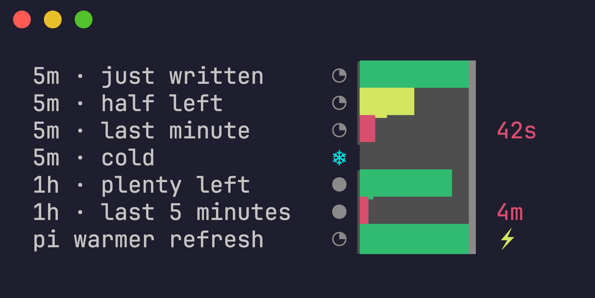
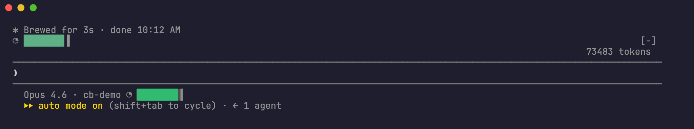
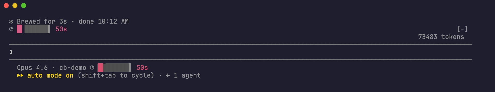
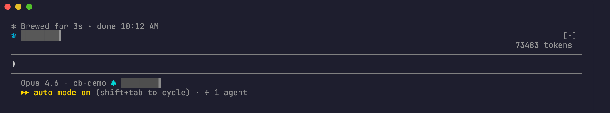
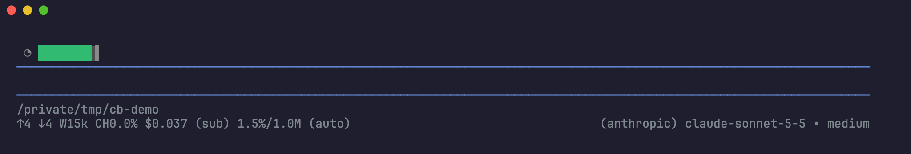
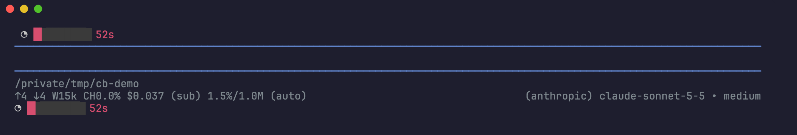
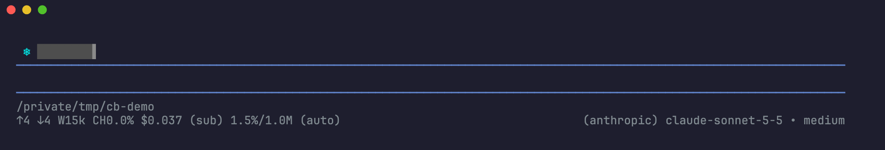

# cache-battery

A prompt-cache timer you read at a glance: the cache is a battery that drains until it goes cold.
It works in [Claude Code](https://code.claude.com) (status line and mod) and in [pi](https://pi.dev).



| Glyph | Meaning |
|---|---|
| `◔` | 5-minute cache tier |
| `●` | 1-hour cache tier |
| `○` | estimated: the provider reports no cache numbers per request ([Cursor in pi](#cursor-estimated)) |
| green / yellow / red | more than 50% / 20–50% / under 20% of the cache lifetime left |
| `42s` | seconds, in the last minute only |
| `4m` | minutes, in the last 5 minutes of a 1-hour cache only |
| `❄` + empty battery | the cache is cold: the next message rewrites the whole prompt |
| `⚡` | pi's cache warmer just refreshed the cache (no message from you) |

When the cache state is unknown (before the first request, or on a provider that reports no cache use), nothing is drawn. A request that fails or is cancelled does not clear the battery: the cache from the request before it is still warm.

## Claude Code

The battery above the prompt is the mod; the one in the status line is the status-line command.





### Status line

```bash
npm install -g https://codeload.github.com/korengast/cache-battery/tar.gz/main
```

If you have no status line yet, or want one setup:

```json
{
  "statusLine": {
    "type": "command",
    "command": "cache-battery statusline --wrap ~/.claude/scripts/statusline.sh",
    "refreshInterval": 1
  }
}
```

`--wrap` runs your current status line with the same input and appends the battery to its last line. Leave it out to print only the battery. A wrapped command that takes longer than 2 seconds is stopped, and the battery still prints.

If you already have your own script, add the segment to it instead:

```bash
CACHE_BATTERY=$(printf '%s' "$INPUT" | cache-battery segment)
```

`refreshInterval` makes the battery drain between events. Use `1` for a smooth countdown; use a larger value if your status line script is slow.

The status line reads Claude Code's built-in `prompt_cache` field (Claude Code 2.1.251+): `ttl` gives the tier and `expires_at` the deadline. On older versions it reads the tail of the session transcript and takes the tier from the newest request that wrote to the cache (`ephemeral_5m_input_tokens` / `ephemeral_1h_input_tokens`).

### Mod

```bash
claude plugin marketplace add korengast/cache-battery
claude plugin install cache-battery@cache-battery
```

Start a new session afterwards. The mod draws the battery above the prompt and updates it every second. It times the cache from every main-conversation request (`turn.step`). Claude Code does not tell mods which tier a request wrote, so the mod follows Claude Code's own rule: `FORCE_PROMPT_CACHING_5M`, then `CLAUDE_CODE_PROMPT_CACHE_TTL`, then `ENABLE_PROMPT_CACHING_1H`, then 1 hour on a subscription and 5 minutes on an API key or a cloud provider. It cannot see the `promptCacheTtl` setting or a subscription in overage; set `CACHE_BATTERY_TTL` if your tier differs. The status line reads the real tier.

**When the mod does not load.** Claude Code rolls mods out with a remote feature flag. That flag service is off when the session uses a third-party provider (Bedrock, Vertex, Foundry, or a custom `ANTHROPIC_BASE_URL`) or when telemetry is off, and then no mod loads. Use the status line in those setups. A first-party session with telemetry off can still use the flag cached from an earlier session with `CLAUDE_CODE_GB_DISK_CACHE_WHEN_TELEMETRY_OFF=1`. `claude --debug` logs why a mod did not load.

## pi

pi has no separate mod system; its extensions do the same job. The extension draws the battery above the editor by default, or in the footer below it.





```bash
pi install git:github.com/korengast/cache-battery
```

Choose where it shows (saved in `~/.pi/agent/cache-battery.json`):

```
/cache-battery above    # default: above the editor
/cache-battery footer   # in the footer below the editor (also: below)
/cache-battery off
```

The extension reads the cache usage pi stores on each assistant message. The tier comes from the `cacheWrite1h` share of the newest cache write; when no write says which, it follows pi's own retention: the model's long lifetime with `PI_CACHE_RETENTION=long`, else the short one. When pi's cache warmer (`cacheWarming`) refreshes the cache, the battery refills and shows `⚡`.

<a id="cursor-estimated"></a>
### Cursor (estimated)

With the [`pi-cursor-sdk`](https://github.com/fitchmultz/pi-cursor-sdk) provider, the battery is an estimate and shows `○` instead of `◔`.

Cursor reports token usage once per agent run, not per model request. The SDK sends it only on `turn-ended`, the `cursor-agent` CLI only in its final `result` event, and the Cursor dashboard lists one usage event per run. Inside a run, pi gets one assistant message per model request, but with no cache numbers.

The extension uses what it does know: each Cursor reply is a model request, so it restarts a 5-minute timer at that reply. What the battery cannot know is whether Cursor's backend kept the cache warm. In practice Cursor sometimes writes the whole prompt again on a new run even a few minutes after the last one, and sometimes reads it back after ten. Read `○` as "time since the last request", not as a promise that the next message is cheap.

When a Cursor reply does carry real cache numbers (some run-final replies do), the battery uses them and shows the normal badge.

## Settings

| Variable | Default | Effect |
|---|---|---|
| `CACHE_BATTERY_NUMBERS` | `end` | `end`: numbers near the end only; `always`; `never` |
| `CACHE_BATTERY_CELLS` | `8` | battery width in cells |
| `CACHE_BATTERY_TTL` | auto | force the tier (`5m` or `1h`) where it cannot be read (the mod, old Claude Code, pi when no cache write names it) |
| `CACHE_BATTERY_PLACES` | saved choice, else `above` | pi only: `above`, `footer` (or `below`), `off` |
| `NO_COLOR` | unset | plain glyphs, no colour |

The status line also takes `--numbers` and `--cells`.

## Accuracy

In the mod and in pi the battery stays full while a request is in flight, because the request keeps its cached prefix alive; it starts to drain when the reply ends. On Cursor in pi it stays full for the whole agent run, because Cursor's own model calls inside the run never reach pi. The status line cannot see a request start: it keeps draining during a reply and refills when Claude Code reports the new deadline.

The cache lifetime restarts when a request is sent. The mod anchors on the request start and the status line on Claude Code 2.1.251+ uses Claude Code's own deadline; the transcript fallback and pi anchor on the time the response is recorded, so they can read up to one response long. That is negligible against an hour and worth knowing against five minutes.

## Design

The element had to read without text, fit in one line next to other status items, and show both how much is left and how urgent it is. Options considered:

- **Hourglass** (`⏳` → `⌛`): only two or three states, so no sense of how much is left.
- **Fuel gauge or arc** in braille dots: compact, but hard to read at terminal sizes.
- **Thermometer** (hot to cold): fits the hot and cold cache vocabulary, but a vertical metaphor in a horizontal line.
- **Battery**: everyone reads it instantly, drains left to right, and the colour carries the urgency.

The battery uses eighth-block glyphs (`▏▎▍▌▋▊▉█`), so 8 cells give 64 levels: on a 5-minute cache it moves every ~5 seconds. Numbers appear only when they change a decision: the last minute, and the last five minutes of a 1-hour cache. The tier is one glyph before the battery, so the battery keeps the same width for both tiers.

## Development

```bash
npm install
npm run build   # tsc to dist/, then copies the mod's helpers to hooks/lib/*.mjs
npm test
```

`src/core` is host-free: cache state from usage samples or the `prompt_cache` field, and the battery as coloured segments. `src/cli.ts`, `hooks/register.mjs` and `src/pi.ts` adapt it to the Claude Code status line, the Claude Code mod and pi.

Claude Code scans a mod's source before it loads it: every hook is a function literal in the module itself, every host call is spelled `$.noun.event(...)` there, and `$.env.get` takes a literal name. That is why `hooks/register.mjs` holds all host calls and imports only pure helpers.

## License

MIT
